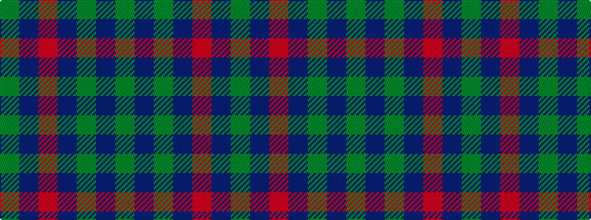

GBGBRBG

It is a 7 stripe tartan.

<figure class="pat-woven">

<figcaption>idealised sample</figcaption>
</figure>

## Colour Sequence



## Tartans with this colour sequence

| Tartans |
|---------------|
| [Orban-Prentice (Personal)](/variants/s7/dg25db4r24db21dy25db4dg3~x2/)|
||
