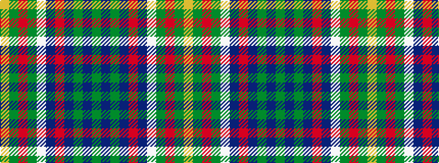

GBGBRBWGRGY

It is a 11 stripe tartan.

<figure class="pat-woven">

<figcaption>idealised sample</figcaption>
</figure>

## Colour Sequence



## Tartans with this colour sequence

| Tartans |
|---------------|
| [Hunter of Hunterston](/variants/s11/g5db2g12db12r2db12w2g12r2g4ly3~x2/)|
||
| [Hunter of Hunterston (Clan)](/variants/s11/g5db2g14db14r2db14w2g14r2g4ly3~x2/)|
||
