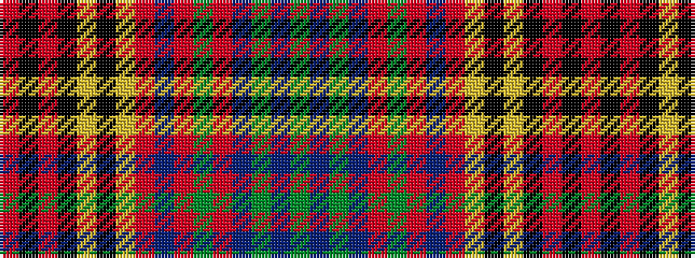

GBGBRGRBRYKYKRKR

It is a 16 stripe tartan.

<figure class="pat-woven">

<figcaption>idealised sample</figcaption>
</figure>

## Colour Sequence



## Tartans with this colour sequence

| Tartans |
|---------------|
| [Du Lion](/setts/s16/r8k8r3k1lo15k3lo3o15b2o2y10o2b1y3b8y8~x2/)|
||
