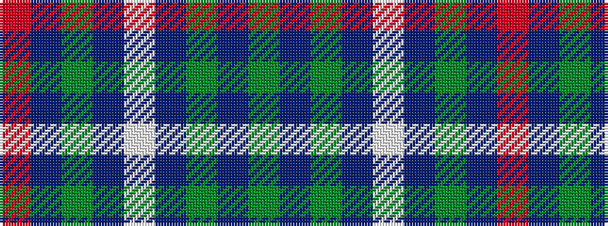

GBGBWBGBR

It is a 9 stripe tartan.

<figure class="pat-woven">

<figcaption>idealised sample</figcaption>
</figure>

## Colour Sequence



## Tartans with this colour sequence

| Tartans |
|---------------|
| [Spirit of Hoxa](/variants/s9/r2p2g3dp10lb2dpi46g2dp19g2~x2/)|
||
| [Spirit of Hoxa District Tartan](/variants/s9/dg2dp19dg2do46lt2dp10dg3n2o2~x2/)|
||
