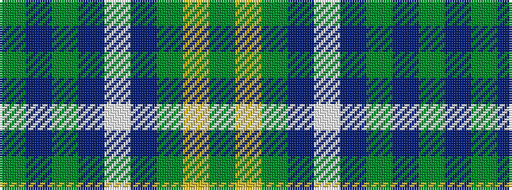

GBGBWBGYG

It is a 9 stripe tartan.

<figure class="pat-woven">

<figcaption>idealised sample</figcaption>
</figure>

## Colour Sequence



## Tartans with this colour sequence

| Tartans |
|---------------|
| [Bedford Academy](/variants/s9/y8ly4y35db2lt8db2y4db21y4~x2/)|
||
