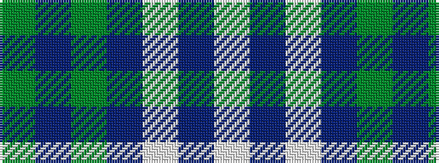

GBGBWBW

It is a 7 stripe tartan.

<figure class="pat-woven">

<figcaption>idealised sample</figcaption>
</figure>

## Colour Sequence



## Tartans with this colour sequence

| Tartans |
|---------------|
| [O'Long (Personal)](/variants/s7/g22dp22g3dp11w3dp4w3~x2/)|
||
