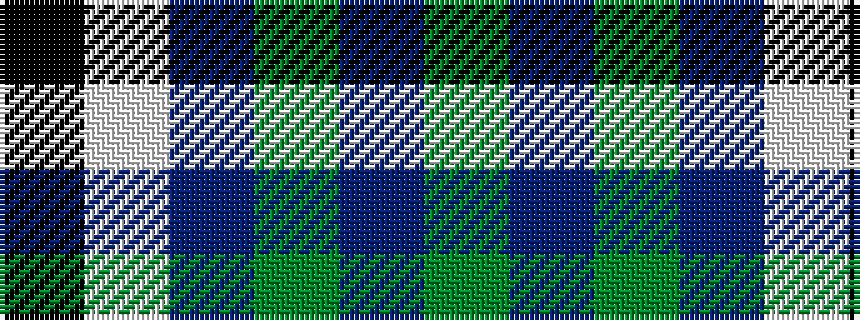

GBGBWK

It is a 6 stripe tartan.

<figure class="pat-woven">

<figcaption>idealised sample</figcaption>
</figure>

## Colour Sequence



## Tartans with this colour sequence

| Tartans |
|---------------|
| [Crombie House Check](/variants/s6/k3lb10db2g6db18g2~x2/)|
||
