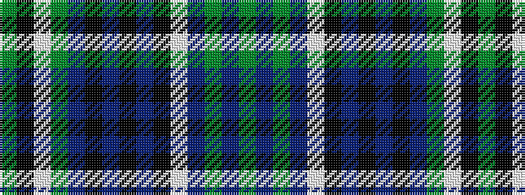

GBGBWKBKBKBGWKG

It is a 15 stripe tartan.

<figure class="pat-woven">

<figcaption>idealised sample</figcaption>
</figure>

## Colour Sequence



## Tartans with this colour sequence

| Tartans |
|---------------|
| [Leel (Personal)](/setts/s15/g8db2g8db10lb2k8t6k2t3k2t6g6w2k2g2~x2/)|
||
