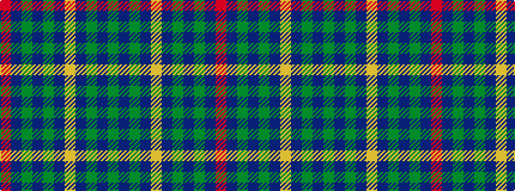

GBGBYBGBGBR

It is a 11 stripe tartan.

<figure class="pat-woven">

<figcaption>idealised sample</figcaption>
</figure>

## Colour Sequence



## Tartans with this colour sequence

| Tartans |
|---------------|
| [Jenkins Welsh Name Tartan](/variants/s11/g8db3g2db4lo2db5g7db4g4db37r6/)|
||
