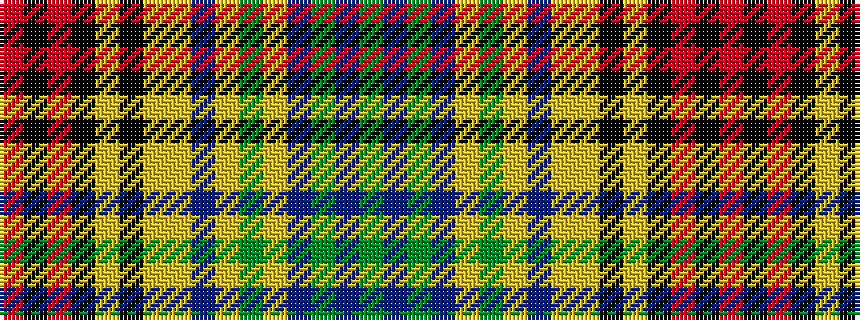

GBGBYGYBYYKYKRKR

It is a 16 stripe tartan.

<figure class="pat-woven">

<figcaption>idealised sample</figcaption>
</figure>

## Colour Sequence



## Tartans with this colour sequence

| Tartans |
|---------------|
| [Du Lion](/variants/s16/dy8db8dy3db1ly2dy10ly2db2ly15ly3k3ly15k1r3k8r8~x2/)|
||
