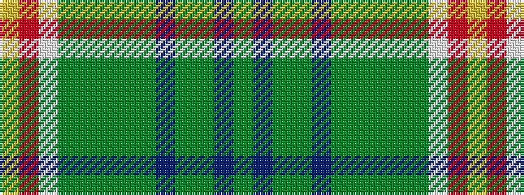

GBGGBGGGGGWRY

It is a 13 stripe tartan.

<figure class="pat-woven">

<figcaption>idealised sample</figcaption>
</figure>

## Colour Sequence



## Tartans with this colour sequence

| Tartans |
|---------------|
| [State Seal of Illinois (Fashion)](/variants/s13/g4db34g4dy4db4dy4g3dy13g21dy4lb3r11lo3~x2/)|
||
