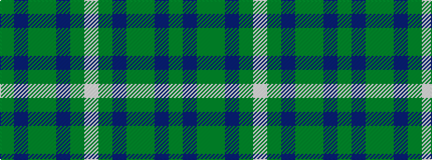

GBGGBGW

It is a 7 stripe tartan.

<figure class="pat-woven">

<figcaption>idealised sample</figcaption>
</figure>

## Colour Sequence



## Tartans with this colour sequence

| Tartans |
|---------------|
| [State Seal of North Carolina (Fash.)](/variants/s7/lb47g6b13dy20g6b6g28~x2/)|
||
