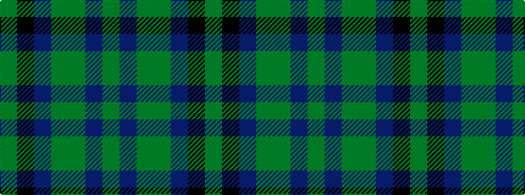

GBGGBKG

It is a 7 stripe tartan.

<figure class="pat-woven">

<figcaption>idealised sample</figcaption>
</figure>

## Colour Sequence



## Tartans with this colour sequence

| Tartans |
|---------------|
| [Calais (Fashion)](/variants/s7/dg11n4dg6dy11n1k1dy4~x4/)|
||
