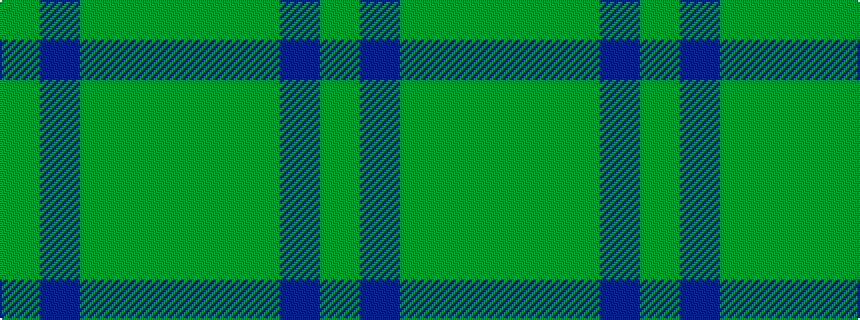

GBGGG

It is a 5 stripe tartan.

<figure class="pat-woven">

<figcaption>idealised sample</figcaption>
</figure>

## Colour Sequence



## Tartans with this colour sequence

| Tartans |
|---------------|
| [Glen Boig](/variants/s5/g13dy3g1do3dy1~x6/)|
||
| [Glen Boig Trade Tartan](/variants/s5/y37dy9y3do9dy3~x2/)|
||
