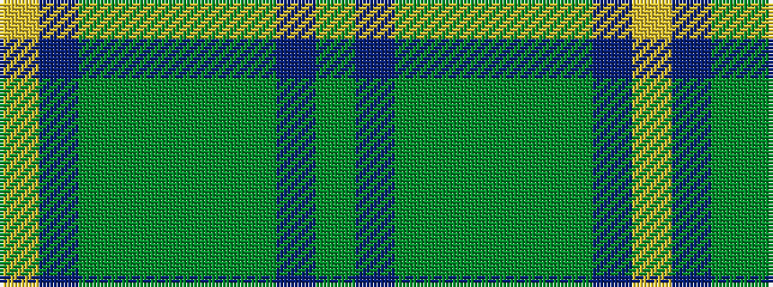

GBGGGGGBY

It is a 9 stripe tartan.

<figure class="pat-woven">

<figcaption>idealised sample</figcaption>
</figure>

## Colour Sequence



## Tartans with this colour sequence

| Tartans |
|---------------|
| [Roast Den, The](/setts/s9/lo62dr12g1g4dg2g4g1dr12dg12~x2/)|
||
