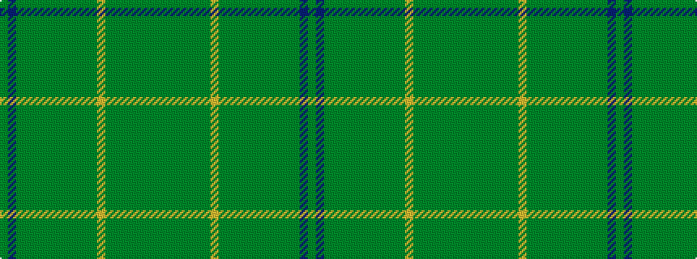

GBGGGGGGGGGGYGGGGGGG

It is a 20 stripe tartan.

<figure class="pat-woven">

<figcaption>idealised sample</figcaption>
</figure>

## Colour Sequence



## Tartans with this colour sequence

This pattern is a design lineage: every tartan below shares one colour order, whatever its owner —
near-identical designs are grouped, the largest lineage first (#112: the pattern is a tartan's
second parent, beside its family or clan).

<table class="sett-table">
<tbody>
<tr><td><a href="/variants/s20/dyi2dr30dyi6g2dy6dyi6dgi2dyi24y2dyi4y2dy24ly2dyi6y6dg2dyi6dg2y27dyi1~x2~dyi1503076-g2408144-dy1503038-dgi1806142-y1904072/">Ebronen (Personal)</a></td></tr>
<tr><td class="sett-swatch"></td></tr>
<tr><td><a href="/variants/s20/dyi2dr30dyi6g2dy6dyi6g2dyi24y2dyi4y2dy24ly2dyi6y6dg2dyi6dg2y27dyi1~x2~dyi1503076-dy1503038-y1904072/">Ebronen (Personal)</a></td></tr>
<tr><td class="sett-swatch"></td></tr>
</tbody>
</table>

