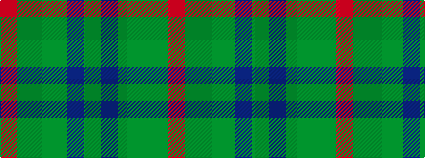

GBGGGR

It is a 6 stripe tartan.

<figure class="pat-woven">

<figcaption>idealised sample</figcaption>
</figure>

## Colour Sequence



## Tartans with this colour sequence

| Tartans |
|---------------|
| [Fraser Hunting #2](/variants/s6/dy1db3dy1dg3dy4r1~x2/)|
||
