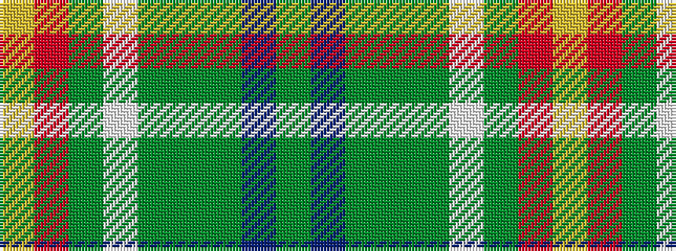

GBGGGWGRY

It is a 9 stripe tartan.

<figure class="pat-woven">

<figcaption>idealised sample</figcaption>
</figure>

## Colour Sequence



## Tartans with this colour sequence

| Tartans |
|---------------|
| [Teallach](/setts/s9/ly4r24dy19w3y23yi13dy3n13dy3~x2/)|
||
