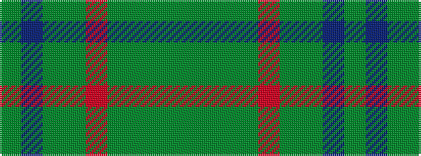

GBGGRGGGG

It is a 9 stripe tartan.

<figure class="pat-woven">

<figcaption>idealised sample</figcaption>
</figure>

## Colour Sequence



## Tartans with this colour sequence

| Tartans |
|---------------|
| [Conlon](/setts/s9/dg4db2dg17dg2r4dg2dg3dg11dg2~x2/)|
||
