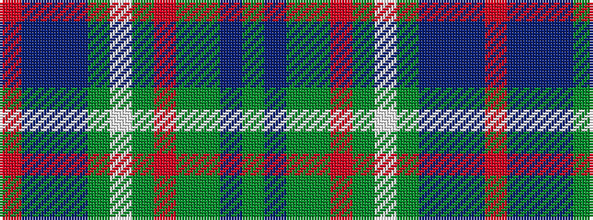

GBGGRGWGBBBR

It is a 12 stripe tartan.

<figure class="pat-woven">

<figcaption>idealised sample</figcaption>
</figure>

## Colour Sequence



## Tartans with this colour sequence

| Tartans |
|---------------|
| [Diana Hunting Plaid](/variants/s12/dy46b3dy7dg2r2dg2w2dg11b6db2b3r2~x2/)|
||
| [Diana Hunting Plaid Tartan](/variants/s12/dy46t3dy7g2r2g2w2g11t6db2t3r2~x2/)|
||
