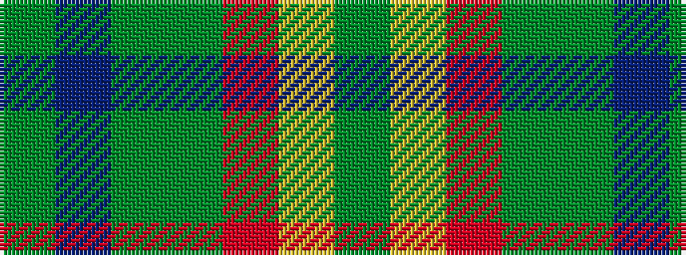

GBGGRYG

It is a 7 stripe tartan.

<figure class="pat-woven">

<figcaption>idealised sample</figcaption>
</figure>

## Colour Sequence



## Tartans with this colour sequence

| Tartans |
|---------------|
| [Christmas Hill Game Farm (Corporate)](/variants/s7/dy5lo20r3dg13dy13db3g3~x2/)|
||
