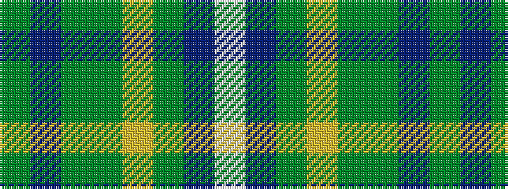

GBGGYGBW

It is a 8 stripe tartan.

<figure class="pat-woven">

<figcaption>idealised sample</figcaption>
</figure>

## Colour Sequence



## Tartans with this colour sequence

| Tartans |
|---------------|
| [Elbrick Hunting (Personal)](/variants/s8/g6ti22g6dy20ly1g45t1w5~x2/)|
||
