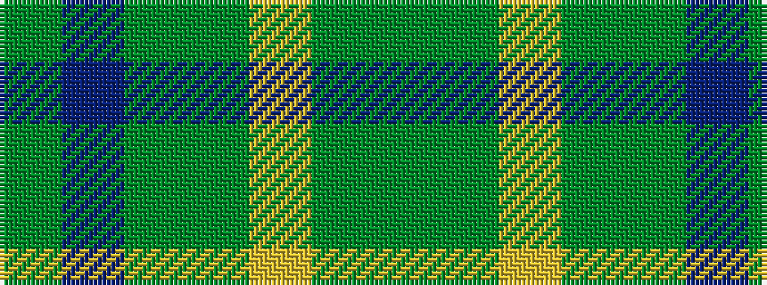

GBGGYGG

It is a 7 stripe tartan.

<figure class="pat-woven">

<figcaption>idealised sample</figcaption>
</figure>

## Colour Sequence



## Tartans with this colour sequence

| Tartans |
|---------------|
| [MacKay - 1800 (Reay Coat) (Artefact)](/variants/s7/dy9g9ly2g9dy9b9dy3~x2/)|
||
