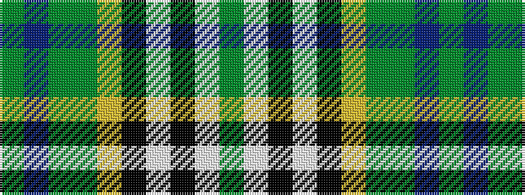

GBGGYKWKWG

It is a 10 stripe tartan.

<figure class="pat-woven">

<figcaption>idealised sample</figcaption>
</figure>

## Colour Sequence



## Tartans with this colour sequence

| Tartans |
|---------------|
| [Order of Saint Lazarus](/variants/s10/g9w9k2w2k2ly2dg28g2db12g4~x2/)|
||
