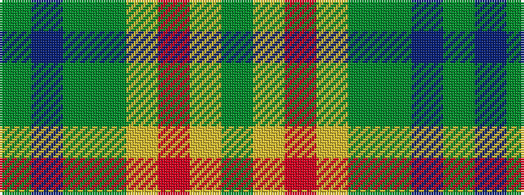

GBGGYRYG

It is a 8 stripe tartan.

<figure class="pat-woven">

<figcaption>idealised sample</figcaption>
</figure>

## Colour Sequence



## Tartans with this colour sequence

| Tartans |
|---------------|
| [Jolley (Personal)](/setts/s8/g4n2gi24dy10ly12r1ly12gi2~x2/)|
||
