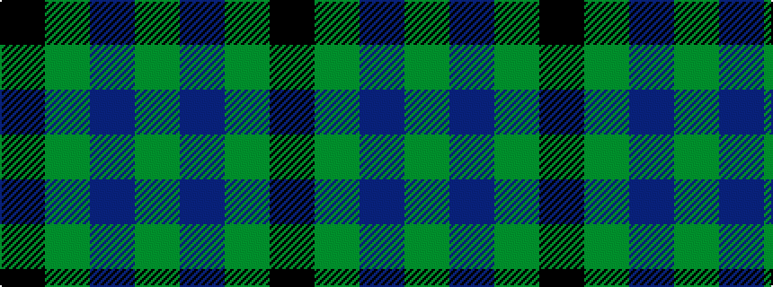

GBGK

It is a 4 stripe tartan.

<figure class="pat-woven">

<figcaption>idealised sample</figcaption>
</figure>

## Colour Sequence



## Tartans with this colour sequence

| Tartans |
|---------------|
| [MacCurdie (Clan?)](/variants/s4/k5g14db12g4~x4/)|
||
