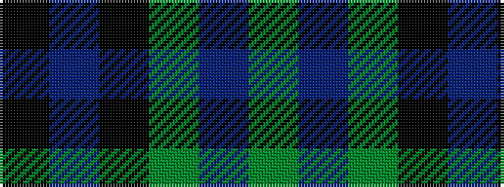

GBGKBK

It is a 6 stripe tartan.

<figure class="pat-woven">

<figcaption>idealised sample</figcaption>
</figure>

## Colour Sequence



## Tartans with this colour sequence

| Tartans |
|---------------|
| [Coburg](/variants/s6/g18t2g4k14dp12k3~x2/)|
||
| [Graham of Menteith](/variants/s6/g18t2g4k14db12k3~x2/)|
||
| [Graham of Menteith](/variants/s6/dg16b2dg1k12db12k1~x2/)|
||
| [Graham of Menteith](/variants/s6/g8b1g1k6db6k1~x4/)|
||
| [Graham of Menteith (Clan)](/variants/s6/g8t1g1k6db6k1~x4/)|
||
| [MacArthur of Milton (Clan)](/variants/s6/g7db1g1k4dp4k1~x4/)|
||
| [MacArthur of Milton Hunting](/variants/s6/dg7db1dg1k4dp4k1~x4/)|
||
| [MacArthur of Milton Hunting Clan Tartan](/variants/s6/g14db2g2k8dp9k2~x2/)|
||
| [MacArthur of Milton, hunting](/variants/s6/g14db2g2k8p9k2~x2/)|
||
| [Wilson's, No 150 "Coburg"](/variants/s6/g18t2g4k14p12k3~x2/)|
||
