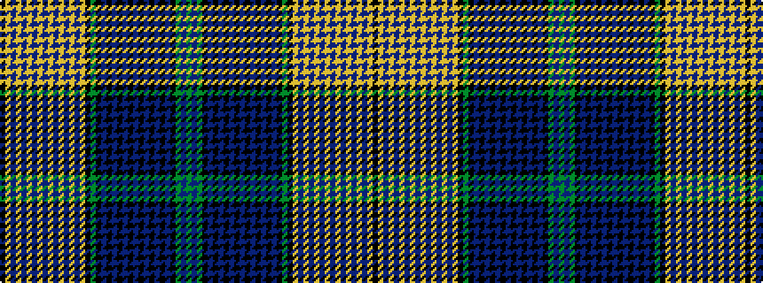

GBGKBKBKBKBKBKBKBKGKYBYBYBYBYBYBYBYK

It is a 36 stripe tartan.

<figure class="pat-woven">

<figcaption>idealised sample</figcaption>
</figure>

## Colour Sequence



## Tartans with this colour sequence

| Tartans |
|---------------|
| [Manitoba (CIDD 28104)](/variants/s36/g50db16g8k8db1k1db1k1db1k1db1k1db1k1db1k1db20k40g12k24lo8db1lo1db1lo1db1lo1db1lo1db1lo1db1lo1db28lo6k4/)|
||
