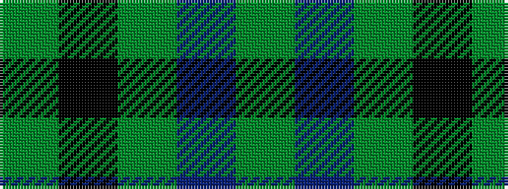

GBGKG

It is a 5 stripe tartan.

<figure class="pat-woven">

<figcaption>idealised sample</figcaption>
</figure>

## Colour Sequence



## Tartans with this colour sequence

| Tartans |
|---------------|
| [Peterhead](/variants/s5/g7db1g2k3g2~x4/)|
||
| [Peterhead (Personal)](/variants/s5/g9n1g2k4g2~x4/)|
||
