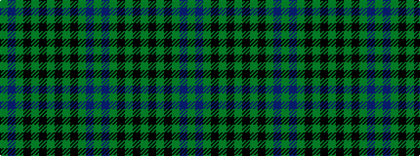

GBGKGKGKGKGBG

It is a 13 stripe tartan.

<figure class="pat-woven">

<figcaption>idealised sample</figcaption>
</figure>

## Colour Sequence



## Tartans with this colour sequence

| Tartans |
|---------------|
| [MacKay](/variants/s13/g6dt28g4k28g28k6g28k6g28k28g4dt28g1~x2/)|
||
