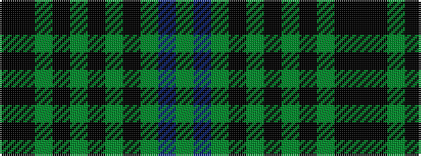

GBGKGKGKGKK

It is a 11 stripe tartan.

<figure class="pat-woven">

<figcaption>idealised sample</figcaption>
</figure>

## Colour Sequence



## Tartans with this colour sequence

| Tartans |
|---------------|
| [South Australia (Disputed)](/setts/s11/g6b24g2k12g8k12g3k8g3k8k3~x2/)|
||
