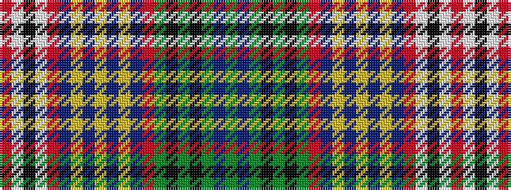

GBGKGKGRBYBYBYBRWKWR

It is a 20 stripe tartan.

<figure class="pat-woven">

<figcaption>idealised sample</figcaption>
</figure>

## Colour Sequence



## Tartans with this colour sequence

| Tartans |
|---------------|
| [McKee (Lone Star) (Personal), Dot](/setts/s20/r21w5k1w5r21db6ly1db3ly1db3ly1db4r3g2k1g2k2g1db2g1~x2/)|
||
