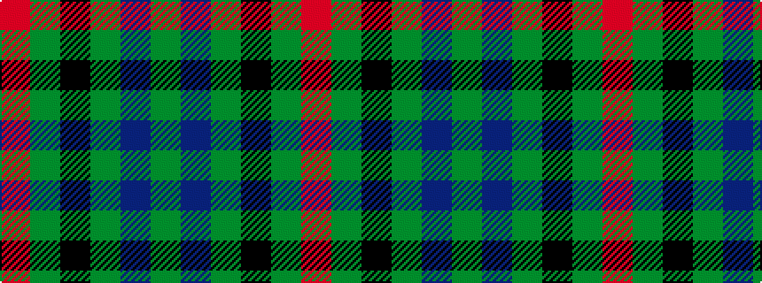

GBGKGR

It is a 6 stripe tartan.

<figure class="pat-woven">

<figcaption>idealised sample</figcaption>
</figure>

## Colour Sequence



## Tartans with this colour sequence

This pattern is a design lineage: every tartan below shares one colour order, whatever its owner —
near-identical designs are grouped, the largest lineage first (#112: the pattern is a tartan's
second parent, beside its family or clan).

<table class="sett-table">
<tbody>
<tr><td><a href="/variants/s6/r4dg11k11dg2db11g3~x4~dg1803171-g1904130/">Casely</a></td></tr>
<tr><td class="sett-swatch"></td></tr>
<tr><td><a href="/variants/s6/r4g11k11g2db11dy3~x4/">Casely (Name)</a></td></tr>
<tr><td class="sett-swatch"></td></tr>
<tr><td><a href="/variants/s6/dg2db12dg1k12dg12r2~x2/">Gunn</a></td></tr>
<tr><td class="sett-swatch"></td></tr>
<tr><td><a href="/variants/s6/r2g12k12g1db12g1~x2/">Gunn</a></td></tr>
<tr><td class="sett-swatch"></td></tr>
<tr><td><a href="/setts/r2g12k12g1db12g2/">Gunn</a></td></tr>
<tr><td class="sett-swatch"></td></tr>
<tr><td><a href="/variants/s6/r4g12k12g2db12g3~x2/">Gunn - 1810 (Clan)</a></td></tr>
<tr><td class="sett-swatch"></td></tr>
<tr><td><a href="/variants/s6/g3db8g3k4g15r2~x2/">Lauder (Family)</a></td></tr>
<tr><td class="sett-swatch"></td></tr>
<tr class="cluster-sep"><td></td></tr>
<tr><td><a href="/variants/s6/r4g11k11g2db11dg3~x4/">Casely</a></td></tr>
<tr><td class="sett-swatch"></td></tr>
</tbody>
</table>

