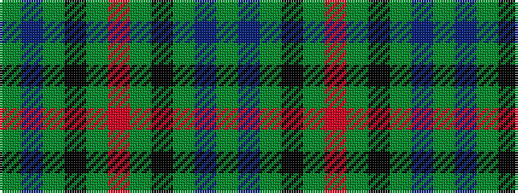

GBGKGRGKGBG

It is a 11 stripe tartan.

<figure class="pat-woven">

<figcaption>idealised sample</figcaption>
</figure>

## Colour Sequence



## Tartans with this colour sequence

| Tartans |
|---------------|
| [Gunn](/setts/s11/g4db28g1k28g28r4g28k28g2db28g1~x2/)|
||
