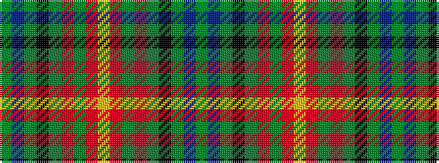

GBGKGRGRYRGRGKGBG

It is a 17 stripe tartan.

<figure class="pat-woven">

<figcaption>idealised sample</figcaption>
</figure>

## Colour Sequence



## Tartans with this colour sequence

| Tartans |
|---------------|
| [Lowland Donnelly (Personal)](/setts/s17/dg5dt2dg12k4dg3o3dg3o13ly3o13dg3o3dg3k3dg12dt2dg5~x2/)|
||
| [Lowland Donnelly (Personal)](/setts/s17/g5dt2g12k4g3r3g3r13ly3r13g3r3g3k3g12dt2g5~x2/)|
||
