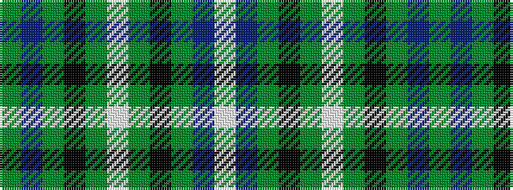

GBGKGWGKGBW

It is a 11 stripe tartan.

<figure class="pat-woven">

<figcaption>idealised sample</figcaption>
</figure>

## Colour Sequence



## Tartans with this colour sequence

| Tartans |
|---------------|
| [Bowlers](/variants/s11/w4db20g5k6g2w3g2k6g13p8g2~x2/)|
||
| [Bowlers (Commemorative)](/variants/s11/w4db20g5k6g2w3g2k6g13dp8g2~x2/)|
||
