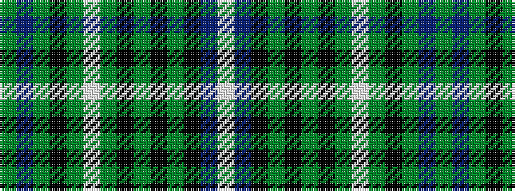

GBGKGWGKGKGKBW

It is a 14 stripe tartan.

<figure class="pat-woven">

<figcaption>idealised sample</figcaption>
</figure>

## Colour Sequence



## Tartans with this colour sequence

| Tartans |
|---------------|
| [St Andrew](/setts/s14/w4db20k1g2k1g2k4g1w2g1k4g16dp8g1~x2/)|
||
