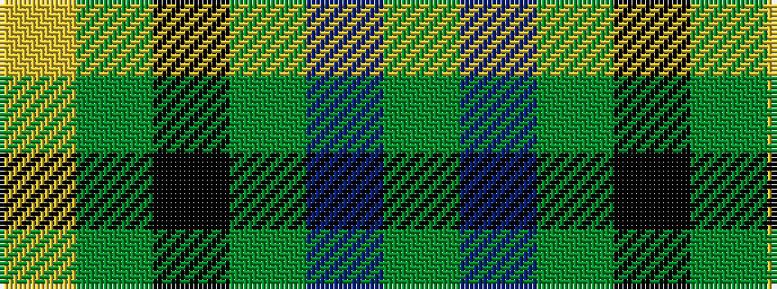

GBGKGY

It is a 6 stripe tartan.

<figure class="pat-woven">

<figcaption>idealised sample</figcaption>
</figure>

## Colour Sequence



## Tartans with this colour sequence

| Tartans |
|---------------|
| [MacKay](/setts/s6/g1db5g1k5g6ly1~x2/)|
||
| [MacKay (Bonner)](/setts/s6/dg1db5dg1k5dg6ly1~x2/)|
||
