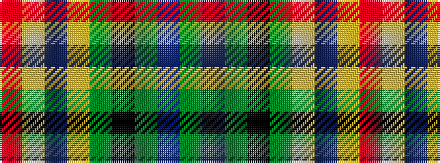

GBGKGYBYR

It is a 9 stripe tartan.

<figure class="pat-woven">

<figcaption>idealised sample</figcaption>
</figure>

## Colour Sequence



## Tartans with this colour sequence

| Tartans |
|---------------|
| [Maitland](/variants/s9/dg3db9dg3k4dg8ly2db2ly2r2/)|
||
| [Maitland](/setts/dg3db8dg3k4dg9ly2db2ly2r2/)|
||
| [Maitland Chief](/variants/s9/g5db24g7k10g24ly2db2ly2r2~x2/)|
||
