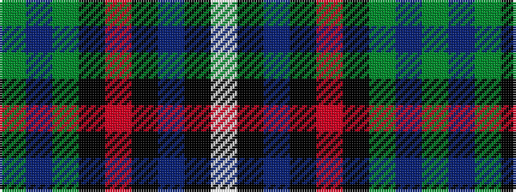

GBGKRKBKW

It is a 9 stripe tartan.

<figure class="pat-woven">

<figcaption>idealised sample</figcaption>
</figure>

## Colour Sequence



## Tartans with this colour sequence

| Tartans |
|---------------|
| [Birch](/setts/s9/g3p4g23k10r2k10t18k1w3~x2/)|
||
| [Birch (Name)](/setts/s9/g3dp2g25k6r2k6t20k1lb2~x2/)|
||
| [Birch (Personal) (Estimated threadcount)](/setts/s9/g2dp2g10k6r2k6t10k1lb2~x2/)|
||
| [Birch Family Tartan Tartan Number: 2157. Earliest known date: 1993 The Birch family tartan was designed and produced by Mr Robin Birch of Connell Reid kiltmaker, Blairgowrie. The new sett has been recorded by the Scottish Tartans Society. See products available Copyright © Blair Urquhart, Comrie, 2015](/setts/s9/g3dp4g23k10r2k10t18k1w3~x2/)|
||
