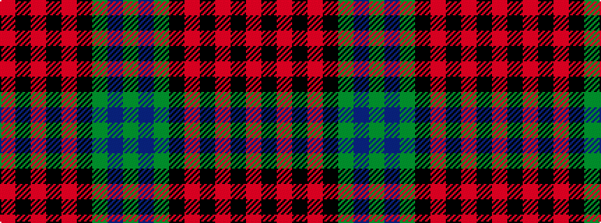

GBGKRKRKR

It is a 9 stripe tartan.

<figure class="pat-woven">

<figcaption>idealised sample</figcaption>
</figure>

## Colour Sequence



## Tartans with this colour sequence

| Tartans |
|---------------|
| [Mostyn](/variants/s9/r20k2r2k2r2k8g24db2g3~x2/)|
||
