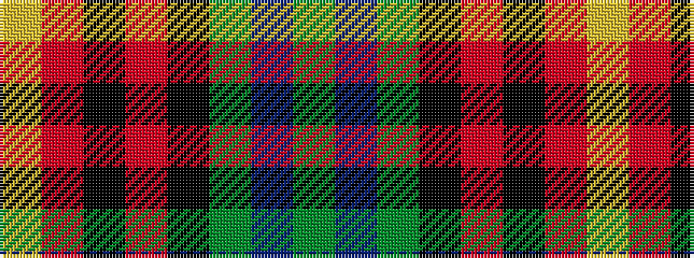

GBGKRKRY

It is a 8 stripe tartan.

<figure class="pat-woven">

<figcaption>idealised sample</figcaption>
</figure>

## Colour Sequence



## Tartans with this colour sequence

| Tartans |
|---------------|
| [Garvock (2015)](/variants/s8/g28t3g3k10r2k10r20ly4~x2/)|
||
