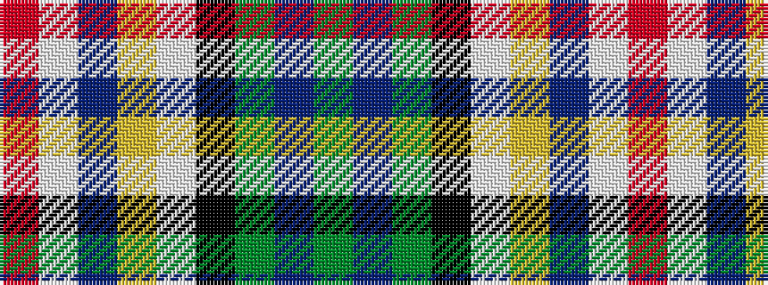

GBGKWYBWR

It is a 9 stripe tartan.

<figure class="pat-woven">

<figcaption>idealised sample</figcaption>
</figure>

## Colour Sequence



## Tartans with this colour sequence

| Tartans |
|---------------|
| [Haymarket, dress Blue](/variants/s9/g5db22g6k10w24ly2db2w2r2~x2/)|
||
