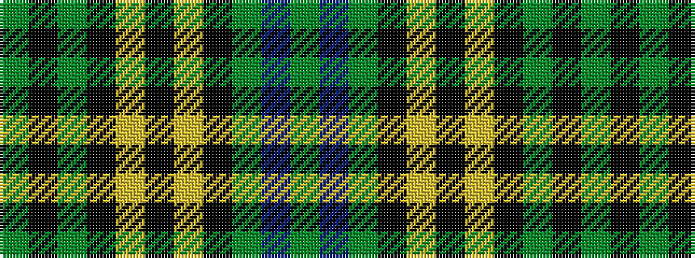

GBGKYKYKGKG

It is a 11 stripe tartan.

<figure class="pat-woven">

<figcaption>idealised sample</figcaption>
</figure>

## Colour Sequence



## Tartans with this colour sequence

| Tartans |
|---------------|
| [Hopetoun](/variants/s11/g13k2g2k11ly1k2ly1k11g2b1g11~x4/)|
||
