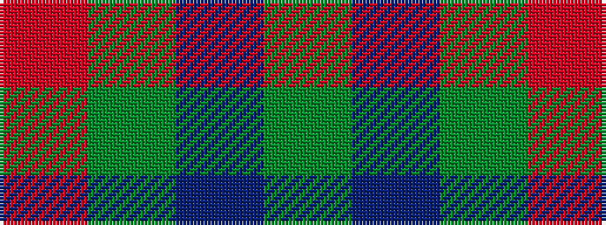

GBGR

It is a 4 stripe tartan.

<figure class="pat-woven">

<figcaption>idealised sample</figcaption>
</figure>

## Colour Sequence



## Tartans with this colour sequence

| Tartans |
|---------------|
| [Barclay](/setts/s4/r1g16db16g1~x2/)|
||
| [Barclay Htg (Clan)](/setts/s4/r1g16db16g1~x4/)|
||
| [Barclay Hunting](/setts/s4/dg1db16dg16r1/)|
||
| [Barclay Hunting](/setts/s4/dg1db16dg16r1~x2/)|
||
| [Barwell](/setts/s4/dg1db3dg3r1~x4/)|
||
| [Gyle](/setts/s4/t8dg1r2~x20/)|
||
| [McWilliams (2014)](/setts/s4/y22dp1y22r4~x4/)|
||
