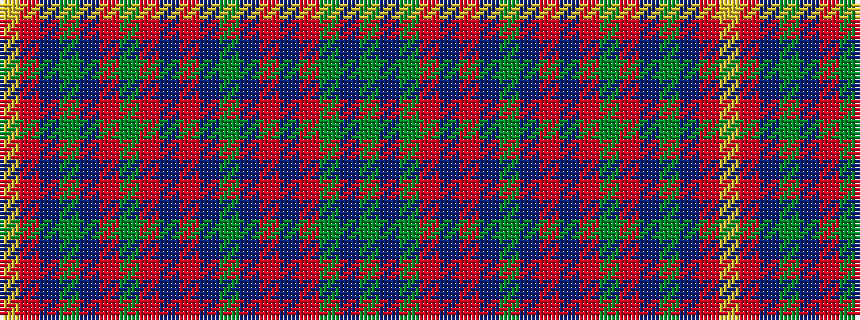

GBGRBRBGBRBRGRBGBRY

It is a 19 stripe tartan.

<figure class="pat-woven">

<figcaption>idealised sample</figcaption>
</figure>

## Colour Sequence



## Tartans with this colour sequence

| Tartans |
|---------------|
| [Jrgensen of Taasingee (Personal)](/setts/s19/lr4r10dt6dg10dt6r22g6r4dt22r4dt22dg36dt22r4dt22r4g6dt10g3/)|
||
