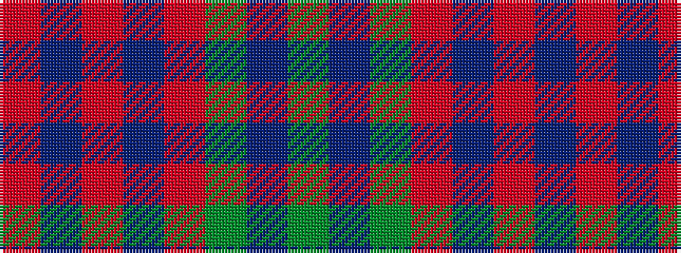

GBGRBRBR

It is a 8 stripe tartan.

<figure class="pat-woven">

<figcaption>idealised sample</figcaption>
</figure>

## Colour Sequence



## Tartans with this colour sequence

| Tartans |
|---------------|
| [Chindecella Gorse (Kemete Heil)](/variants/s8/o9do4o4do4o24dy19do19dy4~x2/)|
||
