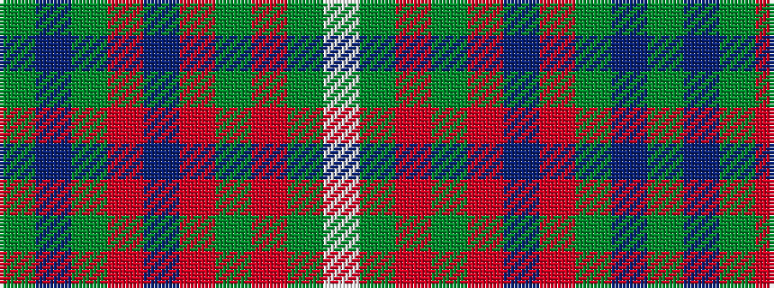

GBGRBRGRGW

It is a 10 stripe tartan.

<figure class="pat-woven">

<figcaption>idealised sample</figcaption>
</figure>

## Colour Sequence



## Tartans with this colour sequence

| Tartans |
|---------------|
| [Island Weavers (Corporate)](/variants/s10/g33db2g33r2db12r12g4r2g4w3~x2/)|
||
