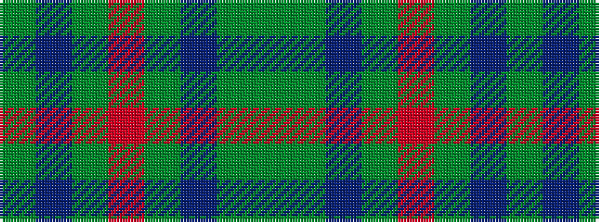

GBGRGBGG

It is a 8 stripe tartan.

<figure class="pat-woven">

<figcaption>idealised sample</figcaption>
</figure>

## Colour Sequence



## Tartans with this colour sequence

| Tartans |
|---------------|
| [Kildare](/variants/s8/g8dr2g13r4g12t22g5y3~x2/)|
||
