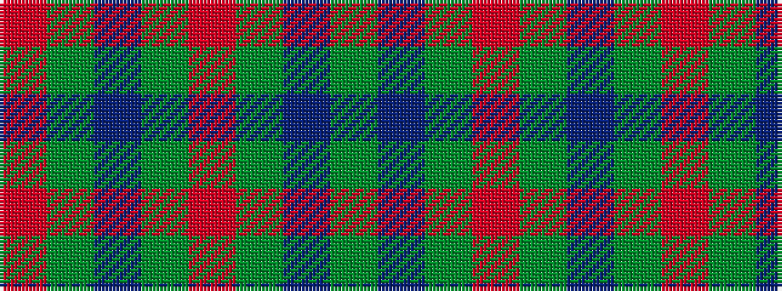

GBGRGBGR

It is a 8 stripe tartan.

<figure class="pat-woven">

<figcaption>idealised sample</figcaption>
</figure>

## Colour Sequence



## Tartans with this colour sequence

| Tartans |
|---------------|
| [Kildare, County (District)](/setts/s8/y8do2y13r4y12db22y5o3~x2/)|
||
